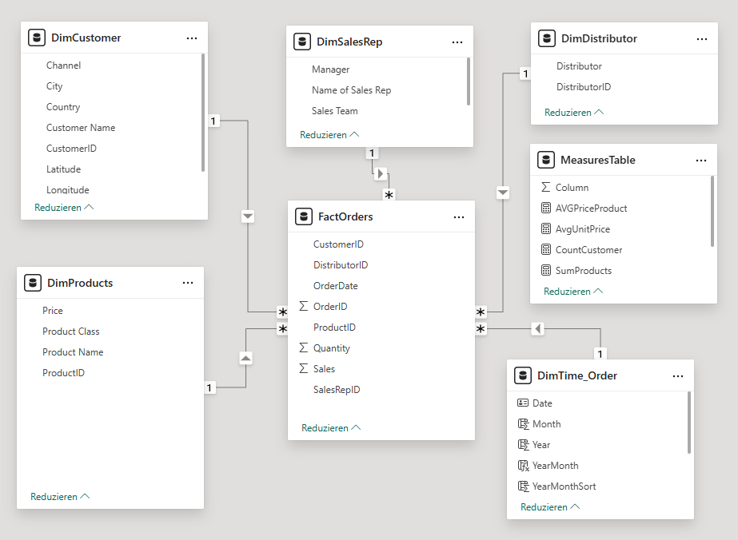

# Sales Performance Dashboard (Power BI)

## Project Overview
This project in german language presents a **multi-page, interactive Power BI dashboard** for analyzing pharmaceutical sales performance in **Germany and Poland**.

The analysis supports **data-driven decision-making** for different business stakeholders by combining a clean dimensional data model with business-focused KPIs, filters, and visualizations.

The project was created as part of a data analytics training program and serves as a **portfolio project for analytics and Power BI roles**.

---

## Business Context
Datamatrix-ml Pharmaceuticals sells its products through **regional distributors**, not directly to end customers.  
The management team requires a professional reporting solution to monitor sales performance, identify top performers, and support strategic decisions across regions, products, and sales teams.

---

## Data Model
A **dimensional data model** (star schema) was implemented to ensure scalability, clarity, and efficient analysis.

The model separates **facts** (sales transactions) from **dimensions** (customers, products, time, distributors, and sales representatives).

### Data Model Overview

### Fact Table
**FactOrders**
- OrderID  
- OrderDate  
- Quantity  
- Sales  
- ProductID  
- CustomerID  
- DistributorID  
- SalesRepID  

### Dimension Tables
- **DimProducts**: Product Name, Product Class, Price  
- **DimCustomer**: Customer, City, Country, Channel, Location (Latitude/Longitude)  
- **DimDistributor**: Distributor  
- **DimSalesRep**: Sales Representative, Manager, Sales Team  
- **DimTime_Order**: Date, Month, Year, YearMonth (marked as date table)  

Natural keys were used where appropriate and stable.  
The model follows best practices for Power BI reporting and DAX-based time intelligence.

---

## Power Query & Data Preparation
Before modeling and reporting, the dataset was validated and prepared in **Power Query**:
- Verification of data types  
- Detection of missing or inconsistent values  
- Removal of duplicates  
- Creation of derived business fields  

A clean **time dimension** was created to enable time intelligence functions such as:
- Year-over-year comparisons  
- Monthly trends  
- YTD calculations  

---

## Report Pages & Use Cases

### 1. Executive Summary (Management)
- Overall sales development by year and month  
- Sales by city, channel, and sub-channel  
- Top-performing product classes, products, and cities  
- High-level KPIs for strategic decision-making  

### 2. Sales Performance (Sales Managers & Field Sales)
- Detailed revenue analysis by distributor and product  
- Top 5 products, customers, and cities  
- Interactive filtering by channel and sub-channel  

### 3. Sales Leadership View (Head of Sales)
- Sales performance by sales team and representative  
- Product performance per sales team  
- Identification of top-performing sales reps and teams  
- Time-based filtering (year, month)  

---

## Key Analytical Focus
- Dimensional modeling (star schema)  
- Business-oriented KPI design  
- Interactive filtering and drill-down analysis  
- Time intelligence using a dedicated date dimension  
- Clear separation of executive, operational, and strategic reporting needs  

---

## Tools & Technologies
- Power BI  
- Power Query  
- DAX  
- Dimensional Data Modeling (Star Schema)  

